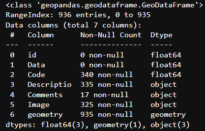
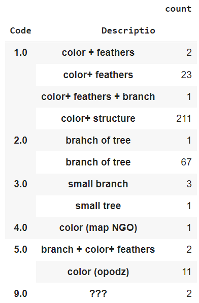
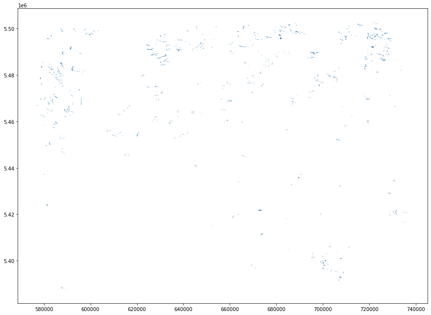
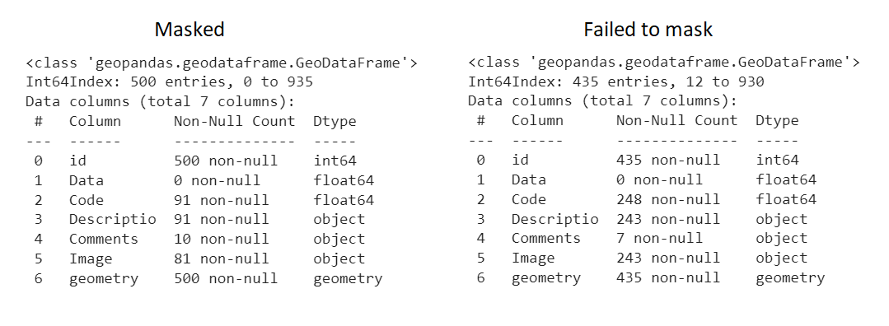
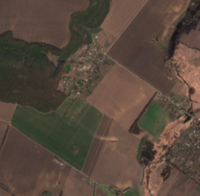
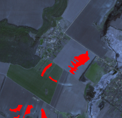
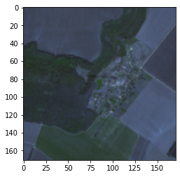
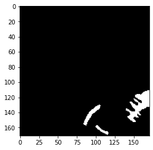
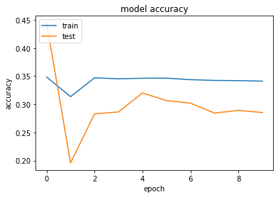
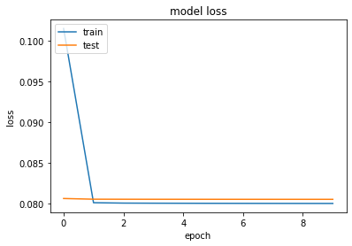

# Soil_erosion_detection
## Description 
Model for detecting soil erosion using geospatial data and imagery. 
&nbsp;

### Table of content
[Analysis](#analysis)
&nbsp;

[Approach](#approach)
&nbsp;

[Model and Results](#model-and-results)
## Analysis
Given dataframe consists of 935 rows and 7 columns
&nbsp;

&nbsp;

**Does every data point _actually_ represent soil erosion case?**
&nbsp;

&nbsp;

Simply relying on dataset makes it not obvious, so a better way to find out is to actually visualise given polygons. At first, lets look at them separately.
&nbsp;

&nbsp;

The original raster image size is (10980, 10980, 3), and plotted polygons make a rectangle instead of a square. So some of our polygons may be lost during masking. 
&nbsp;

Masking files with rasterio returns:
&nbsp;

>Rasterio failed to mask 435 files
&nbsp;

So after aliminating the 'out of bounds' polygons we're left with 500 rows of data.
&nbsp;

*Most of the 'labeled' data is out of raster's bounds so it's lost.*
&nbsp;

&nbsp;

Now plotting polygons over raster:
&nbsp;

  
&nbsp;

As can be seen on the images, some parts of soil with erosion are not coverred with polygons, but all polygons seem to represent soil erosion case.
## Approach
Considering the fact that dataset initially had less than a half of labeled data, and after getting polygons that are in raster bounds that number decreased to less than 20%, there are two possible options: to label data by hand (which would be hard to complete in time), or to use only image and polygons (which is what was desided to do).
&nbsp;

To create a dataset for this approach I created a binary mask for all polygons that are in raster bounds, cut both mask and raster into 4096 pieces, and resized images from (171, 171, 3) to (128, 128, 3). So resulting dataset had an original image and a corresponding binary mask (369 pairs). I also removed all images (and their masks) that did not have soil erosion (based on the binary mask).
&nbsp;

Images plotted before resizing
&nbsp;

  
&nbsp;

## Model and Results
Created tf.keras model performs poorely, which is not really surprising. Possible ways to build a model that could perform well would be getting more data or using transfer learning (e.g. Mask R-CNN).
&nbsp;

  
&nbsp;

